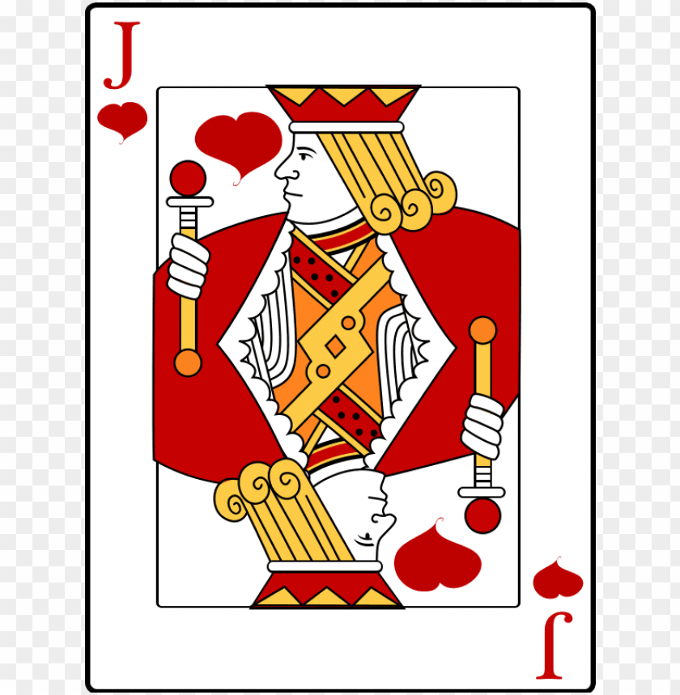

  <a href="https://www.tensorflow.org" target="_blank" rel="noreferrer">  <a href="https://scikit-learn.org/" target="_blank" rel="noreferrer">  <a href="https://pandas.pydata.org/" target="_blank" rel="noreferrer">   <a href="https://www.cprogramming.com/" target="_blank" rel="noreferrer">    </a>    </a>  </a> </a> 

I'm a 4th-year data science student from Finland, and I'm interested in solving problems and learning new solutions, especially in AI!

My GitHub consists mostly of hobby projects, as well as projects done for my studies.

Above are some of the tools I can use, *roughly in order of proficiency*.

You can also find me on [LinkedIn](https://www.linkedin.com/in/ilmariv/)!

### Lines of code in my GitHub repositories (updated on 01 December 2023)
| language | files | code | comment | blank | total |
| :--- | ---: | ---: | ---: | ---: | ---: |
| Python | 277 | 23,356 | 7,414 | 3,857 |** 34,627 **|
| Markdown | 207 | 14,912 | 271 | 6,056 |** 21,239 **|
| Java | 72 | 8,854 | 566 | 1,799 |** 11,219 **|
| MATLAB | 41 | 3,441 | 994 | 968 |** 5,403 **|
| C | 29 | 2,506 | 790 | 485 |** 3,781 **|
| JavaScript | 14 | 2,369 | 341 | 451 |** 3,161 **|
| SQL | 5 | 2,078 | 5 | 54 |** 2,137 **|
| HTML | 14 | 621 | 43 | 131 |** 795 **|
| C++ | 11 | 351 | 371 | 187 |** 909 **|
| Shell Script | 9 | 223 | 54 | 64 |** 341 **|
| Batch | 5 | 193 | 60 | 102 |** 355 **|
| LaTeX | 3 | 140 | 0 | 44 |** 184 **|
| Assembly | 2 | 75 | 0 | 2 |** 77 **|
| Makefile | 6 | 61 | 1 | 26 |** 88 **|

## My projects
Here I've listed some of my projects, that are on Github. They classify into three categories:
* My AI projects
* My other projects
* Projects (both AI and other) for studies

In most cases the project repository contains a more accurate description of what was done in either the README or a report file.

---
### **My AI projects**
---
<!-- Projects in AI table markdown-->
| Title | Description | Link |
| --- | --- | --- |
| **Moska** | Engine and a super-human AI player for a card game called Moska. | [Thesis](https://urn.fi/URN:NBN:fi-fe2023051644576), [MoskaEngine](https://github.com/ilmari99/MoskaEngine), [MoskaResearch](https://github.com/ilmari99/MoskaResearch), [Moska website](https://moska-online.ngrok.app/)
| **TG GPT** | Download a *GPT* based model, finetune on your own TG (group)chat data, and run the bot! | [tgbot_fin_gpt](https://github.com/ilmari99/TGBOT_FIN_GPT)
| **Seal identification**| A Siamese Neural Network for identifying ringed seals. | [ringed-seal-identification](https://github.com/ilmari99/ringed-seal-identification)
|**Oparch** | An old project which attempts to optimize the architecture of a neural network. | [oparch](https://github.com/ilmari99/oparch)

  
---
### **My other projects**
---

<!-- Other own projects -->
| Title | Description | Link |
| --- | --- | --- |
| **Algorithms** | A collection of standalone algorithms and scripts. Tic-Tac-Toe AI, reverse Collatz, Foobar, etc. | [Algorithms](https://github.com/ilmari99/algorithms)
| **Data analysis** | A paid data analysis about housing in the city of Imatra. Contains only part of the results, and in Finnish. | [imatra-public-results](https://github.com/ilmari99/imatra-public-results)
|**Google Foobar** | My solutions to a 5-level programming challenge, which had *very* interesting problems. | [Google-Foobar](https://github.com/ilmari99/google-foobar)

  
---
### **Projects for studies**
---
<!-- Projects done for studies> -->
| Title | Description | Link |
| --- | --- | --- |
|**Math for machine learning** | Projects: Recommendation system using *matrix decomposition*, music classification with *dimensionality reduction* methods, and an SVM classifier for financial news sentiment analysis (also *Word2Vec* model). | [matrix decomposition](https://github.com/ilmari99/M4ML-recommendation-algorithm), [dimensionality reduction](https://github.com/ilmari99/M4ML-dim-reduction), [SVM](https://github.com/ilmari99/M4ML-SVM)
| **Gaussian processes** | Using *Gaussian processes* for regression | [Gaussian processes](https://github.com/ilmari99/GaussianProcessRegression)
| **Cryptography LWE** | Public-key *cryptography* using the Learning-with-errors problem | [LWE](https://github.com/ilmari99/learning-with-errors)
| **Embedded systems** | An alarm system, using C | [embedded-systems-project](https://github.com/ilmari99/embedded-systems-project)
| **Systems programming** | Projects for a course on OS's and systems programming. | [Projects and exercises](https://github.com/ilmari99/Sys-prog-ex)
| **Data analysis** | Data analysis about wine quality | [wine-quality](https://github.com/ilmari99/Wine-analysis)

  
**Thank you for visiting my profile!**

<!---

  

<h3 align="left">Connect with me:</h3>

&nbsp;

-->
