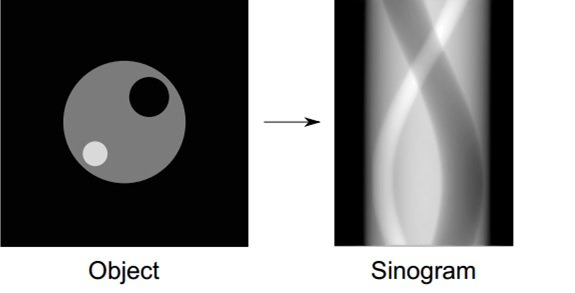
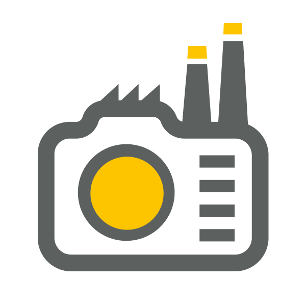
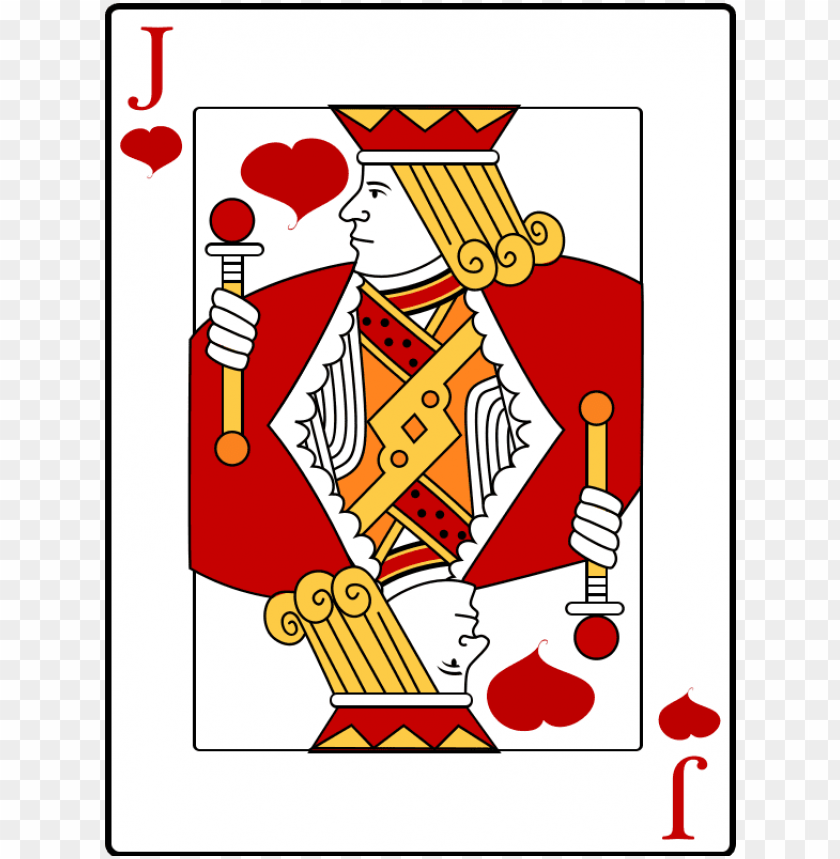
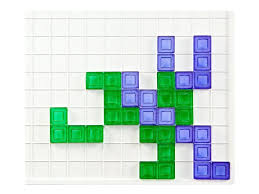
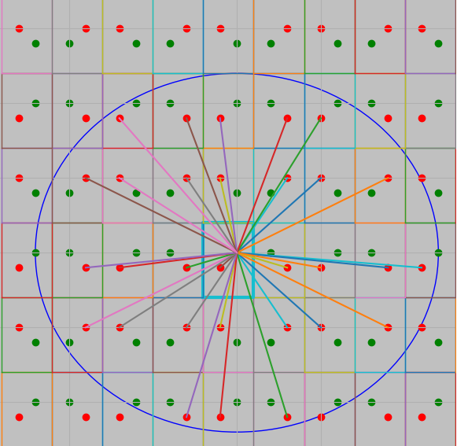

# Ilmari Vahteristo

**Computer vision and data science**  
**LUT University, Finland**

I am passionate about research and entrepreneurship, and I enjoy problem solving, creative work, and organizing. 

---

## 📂 Projects Overview

I’ve organized the projects into:  
1. **AI/ML** – Projects mainly related to machine learning.
2. **Algo/Math/Computer vision** – Other projects related to algorithms, math, computer vision, etc.
3. **Coursework** – Coursework projects.

---

## 🚀 **AI/ML Projects**

| **Project** | **Description** | **Links** |
|-------------|-----------------|-----------|
|  **Inverse Radon Transform** | Our paper and code on computed tomography reconstruction in ultra low-data domains. | [Paper](https://arxiv.org/abs/2502.12293),   [Github](https://github.com/ilmari99/data-efficient-lact) |
|  **EquipSnap** | Junction Hackathon 2024 project: Automated building inventory management. | [EquipSnap](https://github.com/xlDownxl/EquipSnap),  [Demo video](https://www.youtube.com/watch?v=jerwB3SQ5Ok) |
|  **Moska** | Developed an engine and AI player for the card game "Moska". Bachelor's thesis, engine, and online platform. Better than best humans. | [BSc Thesis](https://urn.fi/URN:NBN:fi-fe2023051644576), [MoskaEngine](https://github.com/ilmari99/MoskaEngine), [MoskaResearch](https://github.com/ilmari99/MoskaResearch), [Website](https://www.moska-online.com/) |
|  **AI for Blokus** | Created a pure NN solution for Blokus. The performance is not as good as mcts, but it's pure NN. | [RLFramework](https://github.com/ilmari99/RLFramework) |
|  **Teekkariäly** | Telegram bot and utilities for fine-tuning HuggingFace or OpenAI models using personal Telegram data. | [Teekkarialy](https://github.com/ilmari99/teekkarialy) |
|  **Stock Prediction** | Predicts stock movement (up, down, stable) using multiple stocks' historical prices. Uses transformer models. Optimal market exploitation algorithm if u/d prediction works. | [stonk-prediction](https://github.com/ilmari99/stonk-prediction) |
|  **Seal Identification** | A Siamese Neural Network to identify individual ringed seals. | [ringed-seal-identification](https://github.com/ilmari99/ringed-seal-identification) |

---

## 💡 **Other Projects**

| **Project** | **Description** | **Links** |
|-------------|-----------------|-----------|
|  **Algorithms** | A collection of algorithms, including Tic-Tac-Toe AI, reverse Collatz, and extra Google Foobar challenges. | [Algorithms](https://github.com/ilmari99/algorithms) |
|  **Google Foobar** | Solutions to Google's 5-level programming challenge featuring complex, intriguing problems. | [Google-Foobar](https://github.com/ilmari99/google-foobar) |
|  **Blokus in Python** | A Python wrapper for Pentobi library to play Blokus Classic with a Python API. | [BlokusPentobi](https://github.com/ilmari99/PythonBlokus) |
| **Data Analysis** | Conducted housing data analysis for the city of Imatra. (Results in Finnish.) | [Imatra Results](https://github.com/ilmari99/imatra-public-results) |

---

## 📘 **Course Projects**

| **Project** | **Description** | **Links** |
|-------------|-----------------|-----------|
| **3D Digit Recognition** | Competition-winning submission for 3D digit recognition, achieving the top score since 2016. | [Digit Recognition](https://github.com/ilmari99/DigitRecognition3D) |
| **CoinCounter** | Count the number and type of coins in an image using segmentation, bounding boxes, and color analysis. | [CoinCounter](https://github.com/ilmari99/CoinCounter) |
| **Dynamic Soft Sensor** | Built a predictive sensor for froth flotation plant quality. | [Mining Process](https://github.com/ilmari99/MiningProcessData) |
| **Math for Machine Learning** | Projects include matrix decomposition for recommendations, dimensionality reduction for music classification, and sentiment analysis using Word2Vec and SVM. | [Recommendation](https://github.com/ilmari99/M4ML-recommendation-algorithm), [Dimensionality Reduction](https://github.com/ilmari99/M4ML-dim-reduction), [SVM](https://github.com/ilmari99/M4ML-SVM) |
| **Gaussian Processes** | Used Gaussian Processes for regression analysis. | [Gaussian Processes](https://github.com/ilmari99/GaussianProcessRegression) |
| **Cryptography with LWE** | Implemented public-key cryptography using the Learning-With-Errors problem. | [LWE](https://github.com/ilmari99/learning-with-errors) |
| **Embedded Systems** | Created an alarm system using C. | [Embedded Systems](https://github.com/ilmari99/embedded-systems-project) |
| **Systems Programming** | Completed OS-level programming projects. | [Sys Prog Exercises](https://github.com/ilmari99/Sys-prog-ex) |
| **Wine Quality Analysis** | Conducted a comprehensive analysis of wine quality. | [Wine Analysis](https://github.com/ilmari99/Wine-analysis) |

---

📩 **Want to collaborate or learn more?**  
Feel free to reach out via LinkedIn or explore my GitHub repositories!

  
Code line stats below are updated with a [script](https://github.com/ilmari99/update-code-count-table).
### Lines of code in my GitHub repositories (updated on 05 July 2026)
| language | files | code | comment | blank | total |
| :--- | ---: | ---: | ---: | ---: | ---: |
| Python | 730 | 87,777 | 22,519 | 17,834 | **128,130** |
| Java | 72 | 8,854 | 566 | 1,799 | **11,219** |
| MATLAB | 170 | 7,181 | 2,432 | 2,173 | **11,786** |
| JavaScript | 19 | 3,476 | 594 | 580 | **4,650** |
| toml | 6 | 3,311 | 0 | 178 | **3,489** |
| HTML | 31 | 2,615 | 62 | 285 | **2,962** |
| C | 28 | 2,419 | 780 | 463 | **3,662** |
| MS SQL | 5 | 2,078 | 5 | 54 | **2,137** |
| LaTeX | 21 | 1,921 | 126 | 472 | **2,519** |
| Shell Script | 31 | 985 | 407 | 347 | **1,739** |
| BibTeX | 9 | 914 | 1 | 122 | **1,037** |
| TypeScript | 7 | 597 | 67 | 71 | **735** |
| TypeScript JSX | 10 | 402 | 0 | 48 | **450** |
| C++ | 11 | 351 | 371 | 187 | **909** |
| Gradle | 12 | 206 | 12 | 72 | **290** |
| Skill | 1 | 200 | 0 | 44 | **244** |
| Batch | 5 | 193 | 60 | 102 | **355** |
| LaTeX class | 1 | 184 | 46 | 36 | **266** |
| CUDA C++ | 1 | 100 | 42 | 35 | **177** |
| Assembly | 2 | 75 | 0 | 2 | **77** |
| Makefile | 5 | 51 | 1 | 21 | **73** |
| LaTeX package | 1 | 12 | 2 | 4 | **18** |
| Docker | 1 | 6 | 0 | 5 | **11** |

  <a href="https://www.tensorflow.org" target="_blank" rel="noreferrer">  <a href="https://scikit-learn.org/" target="_blank" rel="noreferrer">  <a href="https://pandas.pydata.org/" target="_blank" rel="noreferrer">   <a href="https://www.cprogramming.com/" target="_blank" rel="noreferrer">    </a>    </a>  </a> </a> 

**Thank you for visiting my profile!**

