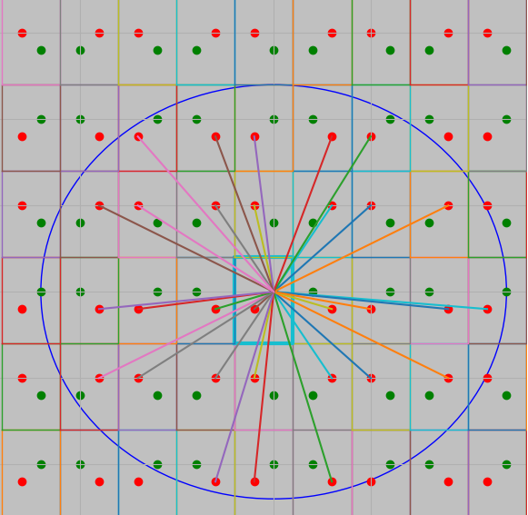

# Ilmari Vahteristo

**Computational Science Student**  
**LUT University, Finland**  

I am passionate about **AI research** and **entrepreneurship**, and I enjoy problem solving and creative work.

---

## 📂 Projects Overview  

I’ve organized my projects into the following categories:  
1. **AI Projects** – Projects mainly related to machine learning.
2. **Other Projects** – Projects exploring algorithms, CT imaging, and other non-ML. 
3. **Cool coursework** – Coursework projects.

---

## 🚀 **AI Projects**

| **Project** | **Description** | **Links** |
|-------------|-----------------|-----------|
|  **Moska** | Developed an engine and AI player for the card game "Moska." Bachelor's thesis, engine, and online platform. | [BSc Thesis](https://urn.fi/URN:NBN:fi-fe2023051644576), [MoskaEngine](https://github.com/ilmari99/MoskaEngine), [MoskaResearch](https://github.com/ilmari99/MoskaResearch), [Website](https://www.moska-online.com/) |
|  **Reinforcement Learning Framework and AI for Blokus** | A modular framework for reinforcement learning experiments: simulate, train, and iterate. Created a pure NN solution for Blokus AI. | [RLFramework](https://github.com/ilmari99/RLFramework) |
|  **Teekkariäly** | Telegram bot and utilities for fine-tuning HuggingFace or OpenAI models using personal Telegram data. | [Teekkarialy](https://github.com/ilmari99/teekkarialy) |
|  **Stock Prediction** | Predicts stock movement (up, down, stable) using multiple stocks historical prices. Optimal exploitation if succesful. Uses transformer models. | [stonk-prediction](https://github.com/ilmari99/stonk-prediction) |
|  **Seal Identification** | A Siamese Neural Network to identify individual ringed seals. | [ringed-seal-identification](https://github.com/ilmari99/ringed-seal-identification) |
| **Oparch** | An early project to optimize neural network architectures. | [Oparch](https://github.com/ilmari99/oparch) |

---

## 💡 **Other Projects**

| **Project** | **Description** | **Links** |
|-------------|-----------------|-----------|
|  **Inverse Radon Transform** | Research on CT imaging reconstruction: Math, Deep image priors, ML. | [limited-angle-tomography](https://github.com/ilmari99/limited-angle-tomography) |
|  **Algorithms** | A collection of algorithms, including Tic-Tac-Toe AI, reverse Collatz, and extra Google Foobar challenges. | [Algorithms](https://github.com/ilmari99/algorithms) |
|  **EquipSnap** | Junction 2024 project: Automated building inventory management. | [EquipSnap](https://github.com/xlDownxl/EquipSnap), [Demo video](https://www.youtube.com/watch?v=jerwB3SQ5Ok) |
| **Data Analysis** | Conducted housing data analysis for the city of Imatra. (Results in Finnish.) | [Imatra Results](https://github.com/ilmari99/imatra-public-results) |
|  **Google Foobar** | Solutions to Google's 5-level programming challenge featuring complex, intriguing problems. | [Google-Foobar](https://github.com/ilmari99/google-foobar) |
|  **Advent of Code 2023** | My solutions to the yearly programming challenge event. | [Advent of Code](https://github.com/ilmari99/advent-of-code23) |
|  **Blokus in Python** | A Python wrapper for Pentobi library to play Blokus Classic with a Python API. | [BlokusPentobi](https://github.com/ilmari99/PythonBlokus) |

---

## 📘 **Course Projects**

| **Project** | **Description** | **Links** |
|-------------|-----------------|-----------|
| **Dynamic Soft Sensor** | Built a predictive sensor for froth flotation plant quality. | [Mining Process](https://github.com/ilmari99/MiningProcessData) |
| **Math for Machine Learning** | Projects include matrix decomposition for recommendations, dimensionality reduction for music classification, and sentiment analysis using Word2Vec and SVM. | [Recommendation](https://github.com/ilmari99/M4ML-recommendation-algorithm), [Dimensionality Reduction](https://github.com/ilmari99/M4ML-dim-reduction), [SVM](https://github.com/ilmari99/M4ML-SVM) |
| **3D Digit Recognition** | Competition-winning submission for 3D digit recognition, achieving the top score since 2016. | [Digit Recognition](https://github.com/ilmari99/DigitRecognition3D) |
| **Gaussian Processes** | Used Gaussian Processes for regression analysis. | [Gaussian Processes](https://github.com/ilmari99/GaussianProcessRegression) |
| **Cryptography with LWE** | Implemented public-key cryptography using the Learning-With-Errors problem. | [LWE](https://github.com/ilmari99/learning-with-errors) |
| **Embedded Systems** | Created an alarm system using C. | [Embedded Systems](https://github.com/ilmari99/embedded-systems-project) |
| **Systems Programming** | Completed OS-level programming projects. | [Sys Prog Exercises](https://github.com/ilmari99/Sys-prog-ex) |
| **Wine Quality Analysis** | Conducted a comprehensive analysis of wine quality. | [Wine Analysis](https://github.com/ilmari99/Wine-analysis) |

---

📩 **Want to collaborate or learn more?**  
Feel free to reach out via LinkedIn or explore my GitHub repositories!

  
Code line stats below are updated with a [script](https://github.com/ilmari99/update-code-count-table).
### Lines of code in my GitHub repositories (updated on 07 October 2024)
| language | files | code | comment | blank | total |
| :--- | ---: | ---: | ---: | ---: | ---: |
| Python | 593 | 57,949 | 6,955 | 10,573 | **75,477** |
| Java | 72 | 8,854 | 566 | 1,799 | **11,219** |
| MATLAB | 60 | 3,721 | 1,092 | 1,109 | **5,922** |
| JavaScript | 19 | 3,475 | 595 | 580 | **4,650** |
| C | 29 | 2,506 | 790 | 485 | **3,781** |
| MS SQL | 5 | 2,078 | 5 | 54 | **2,137** |
| Shell Script | 51 | 1,464 | 602 | 594 | **2,660** |
| HTML | 25 | 1,232 | 51 | 164 | **1,447** |
| C++ | 11 | 351 | 371 | 187 | **909** |
| Batch | 5 | 193 | 60 | 102 | **355** |
| LaTeX | 3 | 140 | 0 | 44 | **184** |
| CUDA C++ | 1 | 100 | 42 | 35 | **177** |
| Assembly | 2 | 75 | 0 | 2 | **77** |
| Makefile | 6 | 61 | 1 | 26 | **88** |

  <a href="https://www.tensorflow.org" target="_blank" rel="noreferrer">  <a href="https://scikit-learn.org/" target="_blank" rel="noreferrer">  <a href="https://pandas.pydata.org/" target="_blank" rel="noreferrer">   <a href="https://www.cprogramming.com/" target="_blank" rel="noreferrer">    </a>    </a>  </a> </a> 

**Thank you for visiting my profile!**

